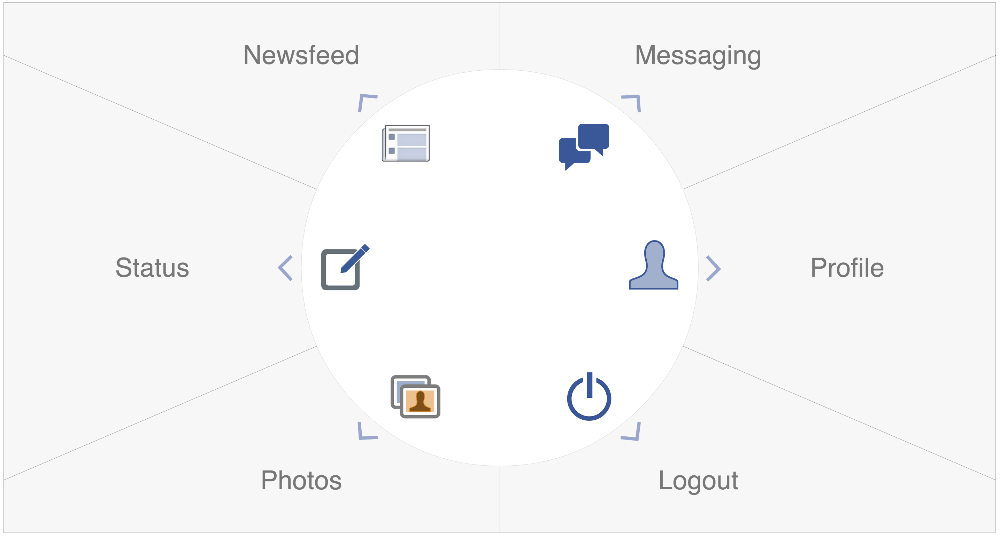

Accessible Facebook UI
====================

An accessible reimplementation of Facebook's core functions, designed to work with eye-tracking technology.

## Contents
- Intro
- Global Features
	- Server
	- Dwell
- Pages	
	- Login
	- Homepage
	- Newsfeed
	- Messaging
	- Status
	- Profile
	- Photos
	- Logout
- Future Features
- Bugs
- Credits

## Intro
The Accessible Facebook UI project is a collaboration between students of CS132 at Brown University and the SpeakYourMind Foundation. It provides a simpler user interface for Facebook that can be controlled by eye-trackers, and uses dwell-click technology. The target users are clients with disabilities that force them to use eye-tracking software to navigate computer systems.

This README explains the Accessible Facebook UI app by feature. First, it explains all global features that apply to multiple sections. Then, it explains each page's functionality. Finally, it explains potential future features, bugs, and credits.

## Global Features

### Server

- / (/index)
	- index.html - Home page
	- First page that is loaded (will redirect to /login if first time)
- Login
	- login.html - Login page
	- Redirects here from any page if login.js says user not logged in
- Messaging
	- messaging.html
- Status
	- status.html
- Profile
	- profile.html
- Newsfeed
	- newsfeed.html
- Notifications
	- notifications.html
- Search
	- search.html

### Facebook API
We use Facebook's Graph API v2.0. Login as well as all HTTP requests are controlled through Facebook's Javascript SDK.

### Dwell-Click
We implemented a dwell-click functionality by which a user may dwell over clickable elements such as buttons and links for 1000ms to click them. The app presents the user with a color-fading visual cue to indicate the process of dwelling and finishing clicking.

##Pages

### Login
- Users can login by dwelling upon the login button in /login. Since login must be controlled through Facebook's dialog boxes, a caretaker would be expected to login once for each user.
- Whenever a user navigates to a page without being logged in, they are redirected to the login page.

### Homepage
- /index is the homepage for the chat application.
- It is written using the Raphael.js library which allows for vector drawing.

### Newsfeed
- /newsfeed renders a user's newsfeed. Facebook's feed items are varied and complex (photos, videos, links etc.); our implementation only displays basic versions of these.
- Newsfeed also allows one to like posts and comment on them. It also shows the people who've liked each post.

### Messaging

### Status
- /status is a simple way for the user to post a text-based status update. It makes use of a dwell-controlled on-screen QWERTY keyboard.

### Profile

### Photos

## Future Features
- Messaging: Compose a new message
- Messaging: Instant messaging only so you only see the messages you only get in a certain session.
- Messaging: We want to use our own node.js server as a BOSH server; right now we still use Converse.JS's test BOSH servier bind.converse.org
- Search
- Friend Requests
- Newsfeed: Reading comments on newsfeed

## Bugs
- Blurry photos for Chat
- If internet times out while loading Chat, Chat will never load. Can be fixed by refreshing.

## Credits
The Accessible Facebook UI project was a semeseter-long project by students of *CS132 - Making Modern Web Apps* at Brown University during Spring 2014 in collaboration with the SpeakYourMind Foundation. Members of the team were:

- Abigail Moses (abigail_moses@brown.edu)
- Athyuttam Eleti (athyuttam_eleti@brown.edu)
	- Built first prototype, SimplePost
	- Developed foundations of Webapp
	- Implemented Facebook API initialization
	- Implemented Login Workflow
	- Implemented Status Update
	- Implemented Newsfeed
- Elyse McManus (elyse_mcmanus@brown.edu)
- Matt Sanders (msanders@risd.edu)
	- Designed interface
	- Coded Homepage
	- Created icons
	- Ongoing design of global features
- Michael Weinstein (michael_weinstein@brown.edu)
